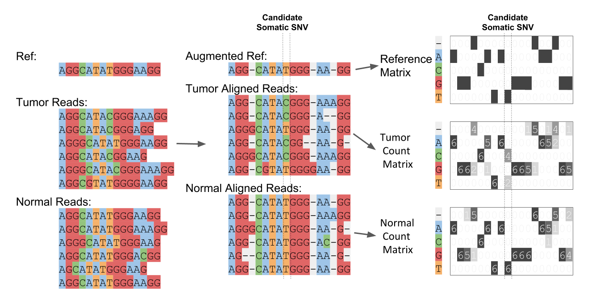

# NeuSomatic: Deep convolutional neural networks for accurate somatic mutation detection

NeuSomatic is based on deep convolutional neural networks for accurate somatic mutation detection. With properly trained models, it can robustly perform across sequencing platforms, strategies, and conditions. NeuSomatic summarizes and augments sequence alignments in a novel way and incorporates multi-dimensional features to capture variant signals effectively. It is not only a universal but also accurate somatic mutation detection method.

For more information contact us at bina.rd@roche.com

## Publication
If you use NeuSomatic in your work, please cite the following preprint:

Sayed Mohammad Ebrahim Sahraeian, Ruolin Liu, Bayo Lau, Marghoob Mohiyuddin, Hugo Y. K. Lam, <br/> 
[Deep convolutional neural networks for accurate somatic mutation detection. bioRxiv (2018): 393801. <br/> 
doi: https://doi.org/10.1101/393801](https://doi.org/10.1101/393801)

## Example Input Matrix


## Table of Contents
**[Availability](#availability)**<br>
**[NeuSomatic Docker Image](#neusomatic-docker-image)**<br>
**[Requird Inputs](#requird-inputs)**<br>
**[Quick Test](#quick-test)**<br>
**[Example Usage](#example-usage)**<br>
**[Ensemble mode](#ensemble-mode)**<br>
**[Creating Training Data](#creating-training-data)**<br>
**[Trained Network Models](#trained-network-models)**<br>
**[HPC run](#hpc-run)**<br>
**[License](#license)**<br>


## Availability

NeuSomatic is written in Python and C++ and requires a Unix-like environment to run. It has been sucessfully tested on CentOS 7. Its deep learning framework is implemented using PyTorch 0.3.1 to enable GPU acceleration for training/testing.

NeuSomatic first scans the genome to identify candidate variants and extract alignment information. 
The binary for this step can be obtained at `neusomatic/bin` folder by running `./build.sh` (which requires cmake 3.12.1 and g++ 5.4.0).

Python 2.7 and the following Python packages must be installed:
* pytorch 0.3.1
* torchvision 0.2.0
* pybedtools 0.7.10
* pysam 0.14.1
* zlib 1.2.11
* numpy 1.14.3
* scipy 1.1.0
* biopython 1.68

It also depends on the following packages:
* cuda80 1.0 (if you want to use GPU)
* tabix 0.2.5
* bedtools 2.27.1
* samtools 1.7

You can install these packages using [anaconda](https://www.anaconda.com/download)/[miniconda](https://conda.io/miniconda.html) :
```
conda install zlib=1.2.11 numpy=1.14.3 scipy=1.1.0 
conda install pytorch=0.3.1 torchvision=0.2.0 cuda80=1.0 -c pytorch
conda install cmake=3.12.1 -c conda-forge
conda install pysam=0.14.1 pybedtools=0.7.10 samtools=1.7 tabix=0.2.5 bedtools=2.27.1 biopython=1.68 -c bioconda
```
g++ 5.4.0 can also be obained as `sudo apt-get install gcc-5 g++-5`.

## NeuSomatic Docker Image

The docker image with all the packages installed (CPU-only) can be found at https://hub.docker.com/r/msahraeian/neusomatic/ 

To use GPU (in `train.py` and `call.py` steps), you should use conda environment to locally install requried packages as shown above.

The dockerfile is also available at `docker/Dockerfile` for local build.

Examples on how to use the docker image are shown at `test/docker_test.sh`.

## Requird Inputs

For training mode, the following inputs are required:
* tumor `.bam` alignment file 
* normal `.bam` alignment file
* training region `.bed` file
* truth somatic variant `.vcf` file

For calling mode, the following inputs are required:
* tumor `.bam` alignment file 
* normal `.bam` alignment file
* call region `.bed` file
* trained model `.pth` file

Reads in input .bam file should be sorted, indexed and have MD tags. If you are not sure about the MD tag, you should run:

```
samtools calmd -@ num_threads -b alignment.bam reference.fasta  > alignment.md.bam 
samtools index alignment.md.bam
```

## Quick Test
Testing the preprocessing, calling, and postprocessing steps:
```
cd test
./run_test.sh
```
The outputs at `test/example/work_standalone/NeuSomatic_standalone.vcf` and `test/example/work_ensemble/NeuSomatic_ensemble.vcf` for stand-alone and ensemble modes should look like `test/NeuSomatic_standalone.vcf` and `test/NeuSomatic_ensemble.vcf`, respectively.

Similarly, you can test docker image as:
```
cd test
./docker_test.sh
```

## Example Usage

For training:
1. Preprocess step in train mode (scan the alignments, find candidates, generate input matrix dataset)
```
python preprocess.py \
	--mode train \
	--reference GRCh38.fa \
	--region_bed region.bed \
	--tumor_bam tumor.bam \
	--normal_bam normal.bam \
	--work work_train \
	--truth_vcf truth.vcf \
	--min_mapq 10 \
	--number_threads 10 \
	--scan_alignments_binary ../bin/scan_alignments
```
2. Train network
```
python train.py \
	--candidates_tsv work_train/dataset/*/candidates*.tsv \
	--out work_train \
	--num_threads 10 \
	--batch_size 100 
```
If you want to continue training starting from a pretrained model you can use `--checkpoint`.

For testing:
1. Preprocess step in call mode (scan the alignments, find candidates, generate input matrix dataset)
```
python preprocess.py \
	--mode call \
	--reference GRCh38.fa \
	--region_bed region.bed \
	--tumor_bam tumor.bam \
	--normal_bam normal.bam \
	--work work_call \
	--min_mapq 10 \
	--number_threads 10 \
	--scan_alignments_binary ../bin/scan_alignments
```
2. Call variants
```
python call.py \
	--candidates_tsv work_call/dataset/*/candidates*.tsv \
	--reference GRCh38.fa \
	--out work_call \
	--checkpoint work_train/some_checkpoint.pth \
	--num_threads 10 \
	--batch_size 100 
```
3. Postprocess step (resolve long INDEL sequences, report vcf)
```
python postprocess.py \
	--reference GRCh38.fa \
	--tumor_bam tumor.bam \
	--pred_vcf work_call/pred.vcf \
	--candidates_vcf work_call/work_tumor/filtered_candidates.vcf \
	--output_vcf work_call/NeuSomatic.vcf \
	--work work_call 
```
Here, the final NeuSomatic prediction is reported at `work_call/NeuSomatic.vcf`.

NeuSomatic will use GPUs in train/call steps if they are avilable. To use specific GPUs for train/call steps, you can set the environment variable `CUDA_VISIBLE_DEVICES` as:

```
CUDA_VISIBLE_DEVICES=0,1,2,3 python train.py ...
```
or
```
CUDA_VISIBLE_DEVICES=0,1,2,3 python call.py ...
```

To run in CPU mode you can disable accessing to GPU by exporting `CUDA_VISIBLE_DEVICES=`.

## Ensemble mode
NeuSomatic can be used universally as a stand-alone somatic mutation detection method or with an ensemble of existing methods. NeuSomatic currently supports outputs from MuTect2, MuSE, Strelka2, SomaticSniper, VarDict, and VarScan2. For ensemble mode, the ensembled outputs of different somatic callers (as a single `.tsv` file) should be prepared and inputed using `--ensemble_tsv` argument in `preprocess.py`. 
This `.tsv` file can be prepared using the SomaticSeq script at https://github.com/bioinform/somaticseq/blob/master/SomaticSeq.Wrapper.sh .

For instance:
```
SomaticSeq.Wrapper.sh \
--output-dir output \
--genome-reference GRCh38.fa \
--tumor-bam tumor.bam \
--normal-bam normal.bam \
 -mutect2 MuTect2.vcf \
--varscan-snv VarScan2.snp.vcf \
--varscan-indel VarScan2.indel.vcf \
 -sniper SomaticSniper.vcf \
--vardict VarDict.vcf \
--muse MuSE.vcf \
--strelka-snv somatic.snvs.vcf.gz \
--strelka-indel somatic.indels.vcf.gz \
--inclusion-region region.bed \
 -dbsnp dbsnp.GRCh38.vcf \
 -gatk GenomeAnalysisTK.jar
```

Then, in the output directory, do:
```
cat <(cat Ensemble.s*.tsv |grep CHROM|head -1) \
    <(cat Ensemble.s*.tsv |grep -v CHROM) | sed "s/nan/0/g" > ensemble_ann.tsv
```
and provide `enemble_ann.tsv` as `--enemble_ann` argument in `preprocess.py`.

**Dockerized solution** for running all of the individual somatic callers (MuTect2, MuSE, Strelka2, SomaticSniper, VarDict, and VarScan2), and the above wrapper that combines their output is explained at [ensemble_docker_pipelines](https://github.com/bioinform/neusomatic/tree/master/ensemble_docker_pipelines).

### NOTE: 

* To train or call in the ensemble mode you should use `--ensemble` argument in `train.py` and `call.py`.

## Creating Training Data
The best performance can be obtained when the network is trained on your input dataset. You can creat training data for your input data using [BAMSurgeon](https://github.com/adamewing/bamsurgeon) that can spike in *in silico* somatic mutations into existing BAM files. The dockerized piplines and complete documentation on how to creat training sets can be found [here](https://github.com/bioinform/somaticseq/tree/master/utilities/dockered_pipelines/bamSimulator).

You can then used the synthetic tumor/normal pair and the known *in silico* spiked mutations (as truth set) to train the NeuSomatic network as shown in [Example Usage](#example-usage).


## Trained Network Models
We provide a set of trained NeuSomatic network models for general purpose usage. Users should note that these models are trained for sepcific settings and are not supposed to work perfectly for all circumestances.
The following models can be found at `neusomatic/models` folder:

Model                                              | Mode         | Training Information                                                        
---------------------------------------------------|---------------|-----------------------------------------------------------------------
`NeuSomatic_v0.1.0_standalone_Dream3_70purity.pth` |  Stand-alone  | WGS Dream Challenge Stage 3 (70% tumor and 95% normal purities, Illumina, BWA-MEM,  ~30x) 
`NeuSomatic_v0.1.0_ensemble_Dream3_70purity.pth`   |  Ensemble     | WGS Dream Challenge Stage 3 (70% tumor and 95% normal purities, Illumina, BWA-MEM,  ~30x) 
`NeuSomatic_v0.1.0_standalone_WEX_100purity.pth`   |  Stand-alone  | WEX (100% tumor and normal purities, Illumina, BWA-MEM,  ~125x)
`NeuSomatic_v0.1.0_ensemble_WEX_100purity.pth`     |  Ensemble     | WEX (100% tumor and normal purities, Illumina, BWA-MEM,  ~125x)


## HPC run
For distributed data processing on HPC platforms, the input regions can be splitted to smaller sub-regions as follows:
```
python split_bed.py \
	--region_bed region.bed \
	--output work \
	--num_splits 10
```
Then, each sub-region can be processed as follows (for instance on SGE cluster):
```
for i in {0..10}
do
	qsub -pe smp 24 \
	"python preprocess.py \
	--mode call [or --mode train]
	--reference GRCh38.fa --tumor_bam tumor.bam --normal_bam normal.bam \
	--region_bed work/splits/region_${i}.bed \
	--work work/work_${i} \
	--min_mapq 10 --number_threads 24 \
	--scan_alignments_binary ../bin/scan_alignments"
done
```
Then the candiate `.tsv` files to be used for train/call can be found at `work_*/dataset/*/candidates*.tsv`.

## License
NeuSomatic is licensed under a Creative Commons Attribution-NonCommercial-ShareAlike 4.0 International License.


